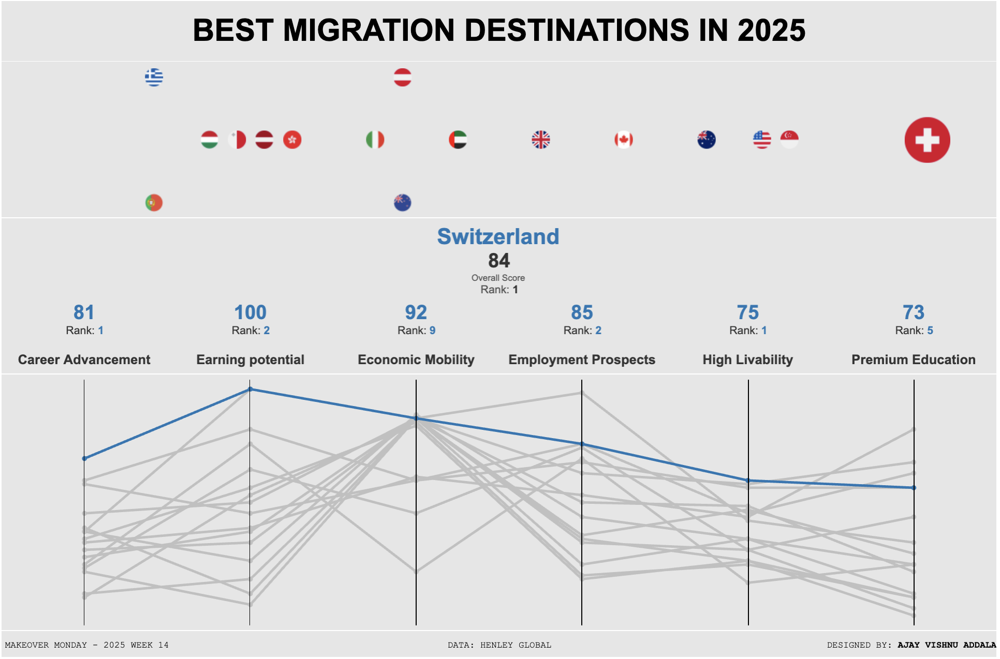

# Best Migration Destinations 2025 - Tableau Dashboard

This repository showcases a Tableau dashboard created for the Makeover Monday Week 14 challenge. The dataset ranks the best migration destinations in 2025 based on various factors such as earning potential, career advancement, and livability.

## Dashboard Highlights

The dashboard includes the following features:

### 1. Beeswarm Chart
- **Purpose:** Visualizes the overall scores of the countries.
- **Design:**
  - Country flags are displayed as icons.
  - Flags are sized dynamically based on the selected country.
  - Clicking on a flag highlights the respective country's data across the dashboard.

### 2. Summary Numbers
- **Purpose:** Displays detailed metrics for the selected country.
- **Metrics:**
  - Overall score and rank.
  - Individual contributor scores (e.g., earning potential, career advancement).
  - Rank in each contributor category.

### 3. Parallel Coordinates Plot
- **Purpose:** Allows comparison of scores across different contributors for all countries.
- **Design:**
  - Lines represent countries.
  - The selected country's line is highlighted for better visibility.
  - Clicking on a line selects the corresponding country, updating the entire dashboard.

## Snapshot

## Tableau Public Link
[View the Dashboard on Tableau Public](https://public.tableau.com/shared/ZH25RTJJQ?:display_count=n&:origin=viz_share_link)  

## Insights
- Identify top countries based on overall scores.
- Analyze specific strengths and weaknesses of each country (e.g., high economic mobility in Austria).
- Compare multiple countries side-by-side across contributors.

